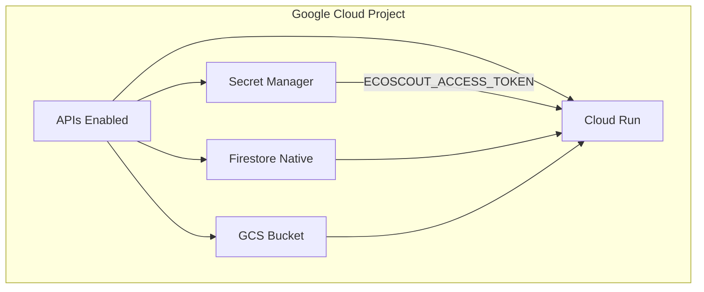

# EcoScout - Full Deployment Plan

Deploy all resources for EcoScout on Google Cloud with Secret Manager for the access token.

## Resources Overview

## Resource List

| Resource | Type | Purpose |
|----------|------|---------|
| **Required APIs** | API Enablement | run, cloudbuild, containerregistry, firestore, storage, aiplatform, secretmanager |
| **Firestore** | Database | Sessions, observations, video metadata (Native mode) |
| **GCS bucket** | Storage | Field guide images, generated videos |
| **Secret Manager** | Secret | ECOSCOUT_ACCESS_TOKEN (access control) |
| **Cloud Run** | Service | FastAPI + ADK agent |

## Deployment Order

1. **APIs** - Enable required Google Cloud APIs
2. **Firestore** - Create Native database (if not exists)
3. **GCS bucket** - Create storage bucket (if not exists)
4. **Secret Manager** - Create secret and add token value
5. **IAM** - Grant Cloud Run service account access to the secret
6. **Cloud Build** - Build Docker image and deploy to Cloud Run
7. **Cloud Run update** - Attach ECOSCOUT_ACCESS_TOKEN from Secret Manager

## Configuration

| Variable | Default | Description |
|----------|---------|-------------|
| `PROJECT_ID` | (required) | GCP project ID |
| `REGION` | us-central1 | Cloud Run region |
| `BUCKET_NAME` | ecoscout-media-{PROJECT_ID} | GCS bucket (must be globally unique) |
| `ACCESS_TOKEN` | (generated) | Secret for app access; omit to auto-generate |
| `FIRESTORE_REGION` | nam5 | Firestore location |

## Post-Deploy Output

- **App URL**: `https://ecoscout-{hash}-uc.a.run.app`
- **Share link**: `https://ecoscout-{hash}-uc.a.run.app/?token={YOUR_TOKEN}`
- **Access form**: Shown when visiting without token
