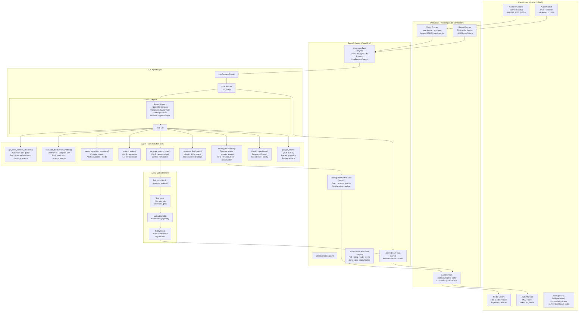

# EcoScout -- Component and Data Flow Architecture

> Detailed internal component view showing tool orchestration,
> async video pipeline, and WebSocket protocol framing.

```mermaid
flowchart TB
    subgraph clientLayer ["Client Layer (Vanilla JS PWA)"]
        direction LR
        camCapture["Camera Capture\ncanvas.toBlob()\n640x480 JPEG @ 1fps"]
        audioCapture["AudioWorklet\nPCM Recorder\n16kHz mono 16-bit"]
        audioPlayer["AudioWorklet\nPCM Player\n24kHz ring buffer"]
        mediaGallery["Media Gallery\nField Guide | Videos\nExpedition Journal"]
        ecologyViz["ecology-viz.js\nD3 Food Web | Accumulation Curve\nSurvey Dashboard Stats"]
    end

    subgraph wsLayer ["WebSocket Protocol (Single Connection)"]
        direction LR
        binaryFrames["Binary Frames\nPCM audio chunks\n~3200 bytes/100ms"]
        jsonFrames["JSON Frames\ntype: image | text | gps\nbase64 JPEG | text | coords"]
        eventStream["Event Stream\naudio parts | text parts\ntool results | notifications"]
    end

    subgraph serverLayer ["FastAPI Server (Cloud Run)"]
        direction TB
        wsEndpoint["WebSocket Endpoint"]
        upstreamTask["Upstream Task\n(async)\nParse binary/JSON\nRoute to LiveRequestQueue"]
        downstreamTask["Downstream Task\n(async)\nForward events to client"]
        videoNotifyTask["Video Notification Task\n(async)\nPoll _video_ready_events\nSend video_ready/started"]
        ecologyNotifyTask["Ecology Notification Task\n(async)\nDrain _ecology_events\nSend ecology_update"]
    end

    subgraph agentLayer ["ADK Agent Layer"]
        direction TB
        lrq["LiveRequestQueue"]
        adkRunner["ADK Runner\nrun_live()"]

        subgraph ecoAgent ["EcoScout Agent"]
            sysPrompt["System Prompt\nNaturalist persona\nProactive behavior rules\nSafety protocols\nAffective response style"]
            toolSet["Tool Set"]
        end
    end

    subgraph toolLayer ["Agent Tools (FunctionTool)"]
        direction TB
        googleSearch["google_search\n(ADK built-in)\nSpecies grounding\nEcological facts"]
        identifyTool["identify_specimen()\nStructure ID result\nConfidence + safety"]
        recordTool["record_observation()\nFirestore write + _ecology_events\nGPS + trophic_level + conservation"]
        fieldGuideTool["generate_field_entry()\nGemini 3 Pro Image\nInterleaved text+image"]
        videoTool["generate_nature_video()\nVeo 3.1 async submit\nContext-rich prompt"]
        extendTool["extend_video()\nVeo 3.1 extension\n+7s per extension"]
        summaryTool["create_expedition_summary()\nCompile journal\nAll observations + media"]
        biodivTool["calculate_biodiversity_metrics()\nShannon H' | Simpson 1-D\nPush metrics to _ecology_events"]
        checklistTool["get_area_species_checklist()\niNaturalist area query\nPush expectedSpecies to _ecology_events"]
    end

    subgraph asyncPipeline ["Async Video Pipeline"]
        direction LR
        veoSubmit["Submit to Veo 3.1\ngenerate_videos()"]
        pollLoop["Poll Loop\n(10s interval)\noperations.get()"]
        uploadGCS["Upload to GCS\nbucket.blob().upload()"]
        notifyClient["Notify Client\nVideo ready event\nSigned URL"]
    end

    camCapture --> jsonFrames
    audioCapture --> binaryFrames
    jsonFrames --> upstreamTask
    binaryFrames --> upstreamTask
    upstreamTask --> lrq

    lrq --> adkRunner
    adkRunner --> ecoAgent
    ecoAgent --> toolSet

    toolSet --> googleSearch
    toolSet --> identifyTool
    toolSet --> recordTool
    toolSet --> fieldGuideTool
    toolSet --> videoTool
    toolSet --> extendTool
    toolSet --> summaryTool
    toolSet --> biodivTool
    toolSet --> checklistTool

    videoTool --> veoSubmit
    veoSubmit --> pollLoop
    pollLoop --> uploadGCS
    uploadGCS --> notifyClient

    adkRunner --> downstreamTask
    notifyClient --> downstreamTask
    downstreamTask --> eventStream
    ecologyNotifyTask --> eventStream
    recordTool --> ecologyNotifyTask
    eventStream --> audioPlayer
    eventStream --> mediaGallery
```
