# EcoScout -- System Architecture

> High-level system architecture for the AI Ecologist.
> Shows the complete data flow from user device through external intelligence
> APIs and Google Cloud services.

```mermaid
flowchart TB
    subgraph userDevice ["User Device (Mobile Browser PWA)"]
        camera["Camera\n(JPEG 1fps)"]
        mic["Microphone + Ambient Sound\n(PCM 16kHz, Echo Cancellation)\nMute/Unmute Toggle"]
        gps["GPS\n(Geolocation API)"]
        ui["Vanilla JS PWA\nCamera | Ecology Dashboard | Food Web | Gallery"]
    end

    subgraph cloudRun ["Google Cloud Run"]
        subgraph fastapi ["FastAPI Backend"]
            ws["WebSocket Endpoint\n/ws/{user_id}/{session_id}"]
            surveyAPI["Survey REST API\n/api/survey | /api/nearby-species"]
            upstream["Upstream Task\n(client -> agent)"]
            downstream["Downstream Task\n(agent -> client)"]
            ecologyNotify["Ecology Notification Task\n_ecology_events queue"]
            videoNotify["Video Notification Task\n_video_ready_events queue"]
        end

        subgraph adkAgent ["ADK Agent Runtime"]
            runner["ADK Runner\nrun_live()"]
            queue["LiveRequestQueue"]
            agent["EcoScout AI Ecologist\nAmbient Sound | Hypothesis | Narrative"]
        end
    end

    subgraph externalIntel ["External Intelligence APIs"]
        inat["iNaturalist API\n100M+ Observations\nSpecies | Conservation | Taxonomy"]
        weather["Open-Meteo API\nTemperature | Humidity | Wind\nEcological Interpretation"]
    end

    subgraph ecoEngine ["Ecological Analysis Engine"]
        biodiv["Biodiversity Calculator\nShannon H' | Simpson 1-D\nRichness | Evenness"]
        gapAnalysis["Gap Analysis\nExpected vs Actual Species\nArea Checklist Comparison"]
        reportGen["Survey Report Generator\nSpecies Inventory | Metrics\nConservation Flags"]
    end

    subgraph geminiAPIs ["Gemini APIs"]
        liveAPI["Gemini Live API\n(bidi WebSocket)\ngemini-live-2.5-flash-native-audio"]
        imageGen["Gemini 3 Pro Image\n(interleaved text+image)\nField Guide Illustration"]
        veo3["Veo 3.1\n(video generation + extension)\nNature Process Videos"]
    end

    subgraph googleCloud ["Google Cloud Services"]
        firestore["Cloud Firestore\nObservations | Sessions\nSurvey Reports | Video Metadata"]
        storage["Cloud Storage\nField Guide Images\nGenerated Videos"]
        searchGrounding["Google Search\nGrounding\nSpecies Verification"]
    end

    subgraph liveDashboard ["Live Survey Dashboard (Frontend)"]
        foodWeb["D3.js Food Web\nTrophic-level colored nodes\nEcological relationships"]
        accumCurve["Species Accumulation Curve\nCanvas-based chart\nExpected species asymptote"]
        dashStats["Survey Stats\nSpecies | Observations\nShannon H' | Coverage"]
    end

    camera -->|"JPEG frames"| ws
    mic -->|"PCM audio +\nambient sounds"| ws
    gps -->|"lat/lon"| ws
    ws --> upstream
    upstream --> queue
    queue --> runner
    runner --> agent

    agent <-->|"bidi streaming\naudio+video+tools"| liveAPI
    agent -->|"species lookup\ngap analysis"| inat
    agent -->|"ecological context"| weather
    agent -->|"diversity indices"| biodiv
    agent -->|"expected vs actual"| gapAnalysis
    agent -->|"survey compilation"| reportGen
    agent -->|"identify + ground"| searchGrounding
    agent -->|"field guide entry"| imageGen
    agent -->|"nature video"| veo3

    agent -->|"save observations\nmetrics + reports"| firestore
    imageGen -->|"store illustrations"| storage
    veo3 -->|"store videos"| storage

    agent -->|"species + metrics\nvia _ecology_events"| ecologyNotify
    ecologyNotify -->|"ecology_update\nWebSocket events"| ws
    agent -->|"video status\nvia _video_ready_events"| videoNotify
    videoNotify -->|"video_ready/started\nWebSocket events"| ws

    downstream -->|"audio + events +\necology updates"| ws
    ws -->|"audio + images + video +\nsurvey metrics + food web"| ui
    ws -->|"species data\nmetrics + relationships"| foodWeb
    ws -->|"accumulation data"| accumCurve
    ws -->|"dashboard metrics"| dashStats
    surveyAPI -->|"survey stats\nnearby species"| ui
```

